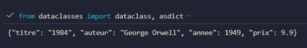
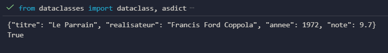

TP Python – Dataclasses pour Livre et Film
---

### Exercice 1 – Classe Livre

#### Objectif
Comprendre l’utilisation du décorateur **@dataclass** pour modéliser une entité **Livre** en Python, en appliquant les concepts d’**immuabilité**, d’**optimisation mémoire** et de **sérialisation JSON**.

#### Description
La classe `Livre` contient les attributs : titre, auteur, année et prix.  
Les objets créés sont **immuables**, optimisés grâce aux **slots**, et peuvent être facilement convertis en **JSON** via une méthode dédiée.

#### Fonctionnalités
- Classe immuable avec `frozen=True`.  
- Optimisation mémoire avec `slots=True`.  
- Méthode `to_json()` pour obtenir la représentation JSON de l’objet.  
- Comparaison automatique des objets basée sur les attributs.

---

### Exercice 2 – Classe Film

#### Objectif
Approfondir la modélisation d’une entité **Film** avec **dataclasses**, en ajoutant des contraintes métier telles que l’**immuabilité**, la **sérialisation JSON** et la méthode spécifique **est_classique()**.

#### Description
La classe `Film` contient les attributs : titre, réalisateur, année et note (de 0 à 10).  
La méthode `est_classique()` retourne **True** si l’année du film est antérieure à 2000.  
La note est automatiquement validée pour respecter les contraintes.

#### Fonctionnalités
- Classe immuable avec `frozen=True`.  
- Optimisation mémoire avec `slots=True`.  
- Méthode `to_json()` pour sérialiser l’objet en JSON.  
- Méthode `est_classique()` pour déterminer si le film est antérieur à l’an 2000.  
- Validation automatique de la note (0 ≤ note ≤ 10).

---
